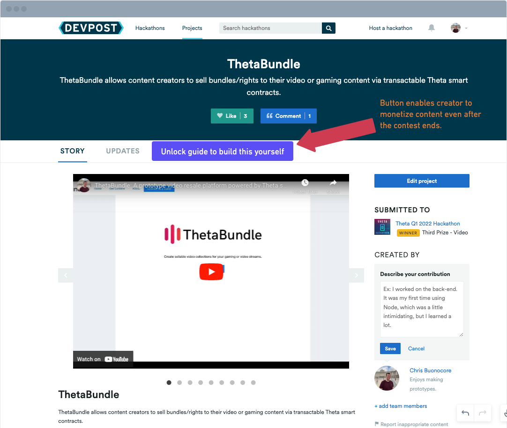

How I built it
---

Prototype idea for monetizing educational guides on hackathons from devpost project pages

## Inspiration

The end of a hackathon project often marks the end of its journey and limits its potential impact. The code is usually uploaded on Github, but without proper guidance, it becomes difficult for others to learn from it and utilize the project's capabilities. Similarly, the Devpost project page may remain static, and without the author's direction, the project becomes stale, reducing its value over time.

To address this issue, Devpost could introduce a 'How I Built It' feature. This feature would take the information typically included in the hackathon project description and allow the author to turn it into a comprehensive guide. The guide could be either paid or free, and the author could market it from the hackathon project page on Devpost.

This feature would serve several purposes. Firstly, it would provide a platform for the author to showcase their expertise and share their knowledge with a wider audience. Secondly, it would help others learn from the project and replicate its success. Thirdly, it would create a new revenue stream for the author, as they could monetize their knowledge and experience.

The 'How I Built It' feature would not only benefit the authors but also the wider community of developers, entrepreneurs, and hackers. It would help preserve the knowledge and experience gained during the hackathon, making it accessible to a wider audience and allowing others to build upon it.

### Benefits

Monetization: Enables potential monetization from the project page even after the contest ends - providing another incentive to create a project.

Improved knowledge sharing: The 'How I Built It' guide would provide a platform for the author to share their knowledge and experience with the wider community. This would help others learn from the project and replicate its success, improving overall knowledge sharing in the development community.

Increased visibility for the project: By creating a comprehensive guide, the author would be able to showcase their expertise and increase visibility for their project. This could lead to new opportunities, collaborations, and recognition for the author.

Enhanced educational resources: The 'How I Built It' guide would serve as an educational resource, providing step-by-step instructions and guidance on how to build a hackathon project. This could be particularly useful for beginners who are new to hackathons and want to learn how to build projects from scratch.

Long-term impact: By preserving the knowledge and experience gained during the hackathon, the 'How I Built It' guide would ensure that the impact of the project continues long after the hackathon is over. This could lead to new innovations, solutions, and applications of the project, enhancing its overall impact.

### Mockup

